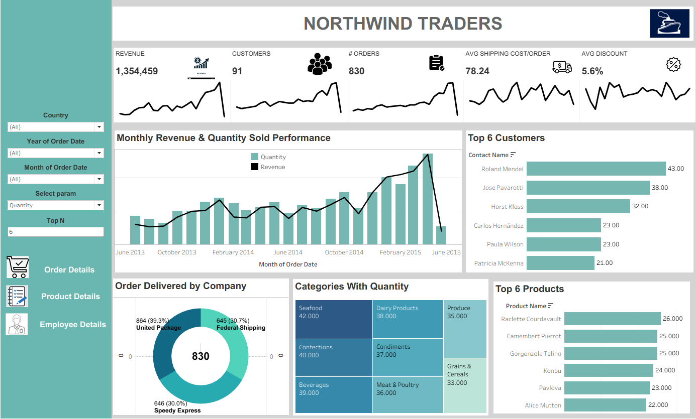
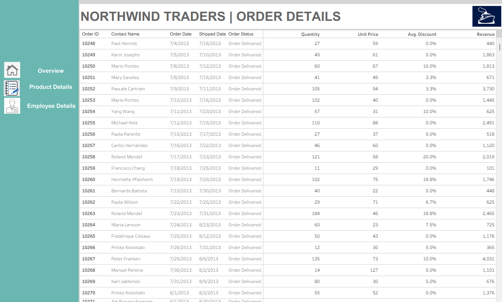
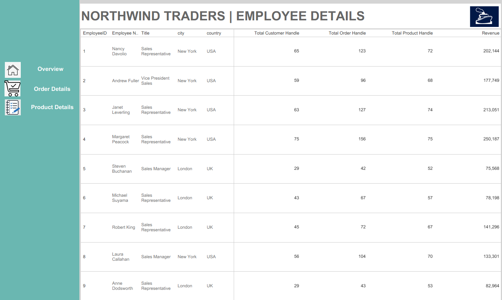
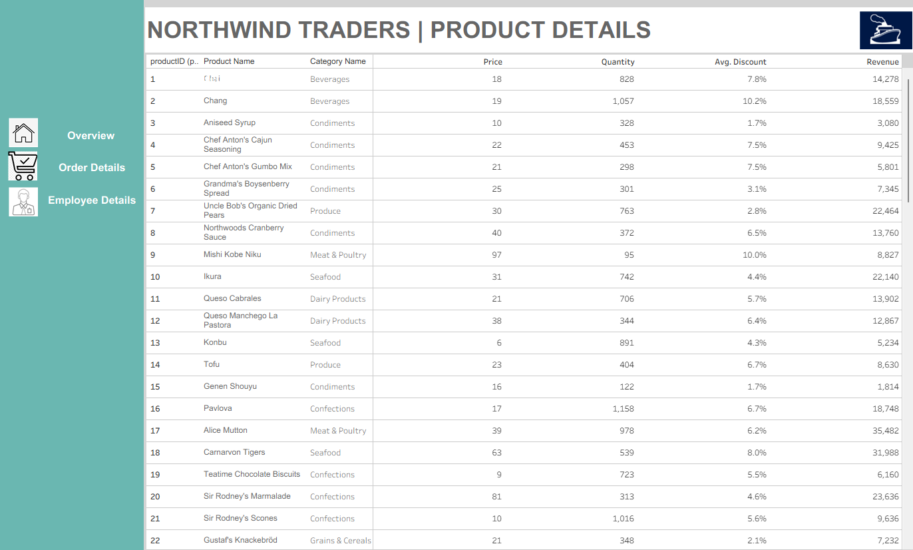

# 📊 Northwind Traders Sales Dashboard

## About This Repository

This repository showcases an interactive **Tableau dashboard** developed using the Northwind Traders dataset. The dashboard provides a comprehensive view of key business metrics, such as revenue, order volume, shipping cost, and top customers/products. It helps stakeholders monitor sales performance, identify trends, and make data-driven decisions.

## 🚀 Key Features

- **KPI Overview**: Track total revenue, customer count, order volume, average shipping cost, and average discount.
- **Monthly Trends**: Visualize monthly revenue and quantity sold from June 2013 to June 2015.
- **Customer Insights**: Identify top-performing customers based on order quantity.
- **Product & Category Analysis**: Explore top-selling products and quantity sold by product category.
- **Shipping Performance**: Breakdown of order deliveries by shipping company.

## 📂 Dashboard Sections

- **Top KPIs**:  
  Revenue: `1,354,459`  
  Customers: `91`  
  Orders: `830`  
  Avg Shipping Cost/Order: `78.24`  
  Avg Discount: `5.6%`

- **Monthly Revenue & Quantity Sold**  
  A combo chart of revenue (line) and quantity (bar) over time.

- **Top 6 Customers**  
  Highlights customers with the highest order quantities.

- **Order Delivered by Company**  
  Donut chart representing the distribution of orders delivered by:
  - United Package (39.3%)
  - Federal Shipping (30.7%)
  - Speedy Express (30.0%)

- **Categories with Quantity**  
  Treemap of product categories with corresponding quantity sold.

- **Top 6 Products**  
  Displays the six most sold products, led by:
  - Raclette Courdavault (26)
  - Camembert Pierrot (25)

## 📸 Dashboard Screenshot

Below is the full screenshot of the interactive dashboard:

## 🛠️ Tools & Technologies

- **Tableau** for dashboard creation
- **Northwind Traders** sample dataset
- **GitHub** for version control and sharing
